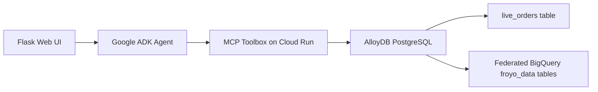

# Project Pioneer: FroyoOS Store Manager

FroyoOS Store Manager is an agentic operations assistant for a frozen yogurt store. It uses Google ADK for agent orchestration, MCP Toolbox for database tools, AlloyDB for transactional orders, and BigQuery federation through AlloyDB for analytical product/allergen data.

The demo shows a store manager asking natural-language questions such as:

- "Does Midnight Swirl have any allergens?"
- "Order 2 Midnight Swirl for Alice."

The agent routes those requests to tools, checks product/allergen relationships, and records live orders.

## Architecture



## Google Cloud / Google AI components

- Google ADK for agent orchestration
- Gemini model via Google GenAI
- MCP Toolbox for declarative database tool access
- Cloud Run for Toolbox deployment
- Secret Manager for Toolbox configuration
- AlloyDB for PostgreSQL transactional storage
- BigQuery federation through AlloyDB for analytical data

## Repo layout

- `app.py` - cloud-backed app using MCP Toolbox and AlloyDB
- `app-nobill.py` - local fallback using CSV files
- `agent_eval.py` - cloud/toolbox evaluation workflow
- `agent_eval_nobill.py` - local fallback evaluation workflow
- `templates/index.html` - web UI
- `tools.yaml` - safe template for MCP Toolbox tools
- `.env.example` - local environment template
- `PROJECT_PIONEER_SETUP.md` - step-by-step setup notes
- `SUBMISSION.md` - Google submission summary

## Run locally with cloud-backed tools

Create `.env` from `.env.example`:

```bash
cp .env.example .env
```

Fill:

```bash
GOOGLE_API_KEY=...
MCP_TOOLBOX_SERVER_URL=https://your-toolbox-service.run.app
PROJECT_ID=eastern-map-498917-i6
GOOGLE_CLOUD_LOCATION=us-east1
MODEL=gemini-2.5-flash
```

Install and run:

```bash
pip install -r requirements.txt
python app.py
```

Open `http://localhost:8080`.

## Run local CSV fallback

```bash
pip install -r requirements.txt
python app-nobill.py
```

## Demo prompts

```text
Does Midnight Swirl have any allergens?
Order 2 Midnight Swirl for Alice.
Does Radiant Dragonfruit Halo have any allergens?
```
