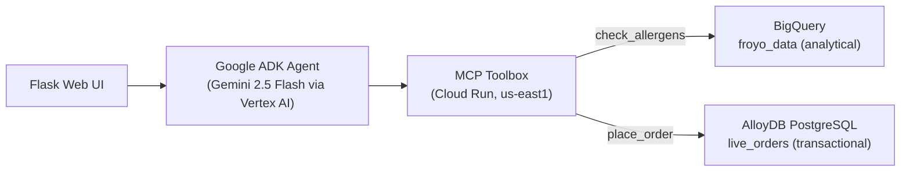

# Project Pioneer: FroyoOS Store Manager

FroyoOS Store Manager is an agentic operations assistant for a frozen-yogurt store. It uses
**Google ADK** for agent orchestration, **MCP Toolbox for Databases** for declarative tool access,
**BigQuery** for analytical product/allergen lookups, and **AlloyDB for PostgreSQL** for live
transactional orders — a true **HTAP** split behind a single conversational agent.

The store manager asks natural-language questions such as:

- "Does Pure Hazelnut Halo have any allergens?" → reads from **BigQuery**
- "Order 2 Pure Hazelnut Halo for Alice." → writes to **AlloyDB**

## Architecture



- The Toolbox runs on **Cloud Run** and reaches AlloyDB's **private IP** via **Direct VPC egress**
  into the `default` network.
- Its `tools.yaml` is stored in **Secret Manager** and mounted at runtime.
- The Toolbox is **private** (org policy blocks public Cloud Run); the agent connects through an
  authenticated `gcloud run services proxy`.

## Google Cloud / Google AI components

- Google ADK (agent orchestration)
- Gemini 2.5 Flash via **Vertex AI** (no API key — uses Application Default Credentials)
- MCP Toolbox for Databases (`bigquery` + `alloydb-postgres` sources)
- Cloud Run (Toolbox hosting, Direct VPC egress)
- Secret Manager (Toolbox config)
- AlloyDB for PostgreSQL (transactional `live_orders`)
- BigQuery (analytical `froyo_data` dataset)
- Flask (web UI)

## Repo layout

- `app.py` — agent app using MCP Toolbox (BigQuery + AlloyDB)
- `app-nobill.py` — local CSV fallback (no cloud)
- `templates/index.html` — web UI
- `tools.yaml` — MCP Toolbox tool definitions (password is injected at deploy time)
- `.env.example` — environment template (Vertex AI by default)
- `DEPLOYMENT.md` — full, verified deploy steps
- `SUBMISSION.md` — Project Pioneer submission summary
- `BLOG.md` — write-up of the build and the bugs fixed along the way

## Quickstart (cloud-backed)

```bash
cp .env.example .env          # Vertex AI defaults; no API key needed
# Deploy the Toolbox (see DEPLOYMENT.md), then in one terminal:
gcloud run services proxy toolbox --region=us-east1 --port=5000
# In another:
pip install -r requirements.txt
python app.py                 # http://localhost:8080
```

## Demo prompts

```text
Does Pure Hazelnut Halo have any allergens?     # -> Soy, Tree Nuts (BigQuery)
Order 2 Pure Hazelnut Halo for Alice.            # -> order id (AlloyDB)
Does Midnight Swirl have any allergens?          # -> none (handles negatives)
```
